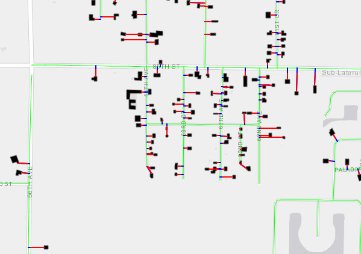
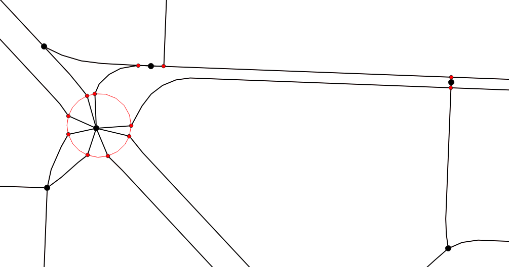

```{r, include = FALSE, echo = FALSE}

knitr::opts_chunk$set(echo = FALSE, message = FALSE, warning = FALSE)

require(tidyverse)
require(sf)
library(arcgisbinding)
library(raster)
library(tmap)
library(kableExtra)

options(width = 2000)

tmap_mode("view")

arc.check_product()

options(scipen=999)
```

```{r}
#SPCC colors

spcc_palette <- c("#267300", '#D7C29E', "#FFFFD4", "#F5EE1C", "#FFBEBE", "#E60000", "#730000", "#89CD66", "#828282", "#AA66CD", "#004C73", "#00C5FF")

spcc_labels <- c("C1", "C2", "C3R", "C3C", "C4", "C5", "C6", "Protected/Rec", "Industrial", "Vacant Comm.", "Intermodal Hub", "Higher Ed")

numeric_reclass_orig <- c(2, 307, 330, 400, 500, 600, 700, 800, 801, 901, 902)

numeric_reclass <- c(1, 2, 3, 3, 4, 5, 6, NA, NA, NA, NA)

reclass_matrix <- cbind(numeric_reclass_orig, numeric_reclass)

```

# Overview

The purpose of this page is to review SPCC version 1.3c and compare it to version 1.0. Version 1.0 represents the existing version of SPCC and provides a baseline for comparison. Version 1.3c includes updated data layers where new data is available in addition to refined measures for evaluating intersection density, building placement, and land use diversity. Further, version 1.3c includes modified weights for density, diversity, and design scores. 1.3c differs from 1.3b in that the building setback search radius was changed from 1320 feet to 250 feet.

#### Updated Weights in 1.3 Versions

|           | SPCC 1.0 | SPCC 1.3a | SPCC 1.3b |
|-----------|----------|-----------|-----------|
| Density   | 50%      | 33%       | 25%       |
| Diversity | 25%      | 33%       | 25%       |
| Design    | 25%      | 34%       | 50%       |

: SPCC Weights by Version

## Data Notes

Version 1.3c includes the following changes from version 1.0.

#### New Intersection Density Measure

-   Prior to estimating intersection density, two pre-processing steps were added to *remove duplicate intersections* in the network (such as with dual carriageways) and *dead end nodes*, preventing them from being counted as a intersection in the density analysis.
-   The intersection density measure itself was modified to measure a *1/4-mile network distance* instead of straight-line buffer. This change better estimates on-the-ground conditions and reflects real-world barriers, such as waterways and roadways without any crossings.

#### New Land Use Diversity Measure

-   Instead of counting the number of different land uses in a given area, the Effective Number of Parties (ENP) diversity measure is applied, resulting in *weighted approach* to number of different land uses.

#### New Building Placement Measure

-   A new analytic method was implemented, which *measures the distance from building edge to street network*, resulting in a more direct estimation of setback from version 1.0.

#### Updated Data

-   All datasets used in the analysis were *updated with latest vintages*, when available, with the exception of truck volume and AADT. We are in the process of incorporating these new data, but expect them to change the classification in meaningful ways.

More information about each of the three new measures is provided in the Comparison of Updated Measures section.

### SPCC Legend


# SPCC 1.0 and SPCC 1.3c Mapping: Detailed Analytic Land Use

```{r}

spcc10_gdb <- "K:\\Projects\\D4_CSHnetwork\\Features\\LU\\SPCC\\Outputs\\Existing\\PBC\\Version4k.gdb"

spcc13c_gdb <- 'K:\\Projects\\D4_CSHnetwork\\Features\\LU\\SPCC_20\\spcc_v2_13b\\outputs\\existing\\Version_2_1_3c.gdb'

spcc10 <- as.raster(arc.raster(arc.open(paste0(spcc10_gdb, "\\DetAnalyticLU_FINAL"))))

spcc13c <- as.raster(arc.raster(arc.open(paste0(spcc13c_gdb, "\\DetAnalyticLU_FINAL_reclass"))))

crs(spcc10) <- crs(spcc13c)

diff <- overlay(spcc10, spcc13c, fun=function(a,b) return(a==b))

#calculate directional change

spcc10_reclass <- reclassify(spcc10, reclass_matrix)

spcc13c_reclass <- reclassify(spcc13c, reclass_matrix)

directional_change <- overlay(x = spcc10_reclass, y = spcc13c_reclass, fun = function(x, y) ifelse(x < y, 3,ifelse(x == y, 2,ifelse(x > y, 1, NA))))

change_labels <- c("Moved to Lower Class", "No Change", "Moved to Higher Class")

#generate maps of results

map1 <- tm_shape(spcc10) + tm_raster(style = "cat", palette = spcc_palette, labels = spcc_labels, title = "SPCC 1.0") + tm_basemap("Esri.WorldImagery")

map2 <- tm_shape(spcc13c) + tm_raster(style = "cat", palette = spcc_palette, labels = spcc_labels, title = "SPCC 1.3c") + tm_basemap("Esri.WorldImagery")

map3 <- tm_shape(diff) + tm_raster(style = "cat", palette = 'viridis', title = "Difference") + tm_basemap("Esri.WorldImagery")

map4 <- tm_shape(directional_change) + tm_raster(style = "cat", palette = 'viridis', labels = change_labels, title = "Directional Change (1-6 Only)") + tm_basemap("Esri.WorldImagery")

tmap_arrange(map1, map2, map3, map4, ncol = 1, sync = TRUE)

```

**Note: The Directional Change map only shows changes between detailed analytic classes C1-C6. Protected/Rec, Industrial, Vacant Comm, Intermodal Hub, and Higher Ed classes are excluded.**


### Cross tabulation of SPCC 1.0 versus SPCC 1.3c

The table below reviews changes from SPCC version 1.0 to 1.3c in tabular form. The rows indicate the number of cells of each SPCC classification in version 1.0. The columns represent the number of cells in version 1.3c. This allows for a quick review of which categories are changing, and how they are shifting.

```{r}
crosstab(spcc10, spcc13c) %>% kbl() %>% 
  kable_paper("hover", full_width = F) %>% 
  column_spec(1, bold = T, border_right = T)
```

# Comparison of Updated Measures

The following series of maps provide a side-by-side comparison of how different input layers differ between versions 10. and 1.3c. The purpose of these maps is to review how the new refined measures compare to the old measures used in version 1.0.

## Building Placement

### Changes in Measure

The following maps review the new building placement input layers. In version 1.3c, a setback is estimated for each building. This measurement is computed with two datasets: building footprints and the street network. The center of the edge of a building that is nearest to any non-private street is is identified, and the distance from this point to the street centerline is calculated. This distance is then associated with the building.

{width="322"}

### Mapping Building Placement Measures

```{r}

spcc10_bulding_placement <- as.raster(arc.raster(arc.open(paste0(spcc10_gdb, "\\BE_03Design_01BldgPlcmt"))))

spcc13c_bulding_placement <- as.raster(arc.raster(arc.open(paste0(spcc13c_gdb, "\\BE_03Design_01BldgPlcmt"))))

crs(spcc10_bulding_placement) <- crs(spcc13c_bulding_placement)
```

```{r}
spcc_building_placement_1 <- tm_shape(spcc10_bulding_placement) + 
  tm_raster(style = "fixed", title = "SPCC 1.0 Building Placement",
            breaks = c(0, 20, 75, 999999),
            palette = 'viridis') + tm_basemap("Esri.WorldImagery")

spcc_building_placement_2 <- tm_shape(spcc13c_bulding_placement) + 
  tm_raster(style = "fixed", title = "SPCC 1.3c Building Placement",
            breaks = c(0, 20, 75, 999999),
            palette = 'viridis') + tm_basemap("Esri.WorldImagery")


tmap_arrange(spcc_building_placement_1, spcc_building_placement_2, sync = T, ncol = 2)
```

### Changes in Intersection Density

Version 1.3c incorporates three changes from 1.0 intended to significantly improve the intersection density measures and better account for barriers such as waterways and nuances in street network datasets. First, two pre-processing steps are added to remove duplicate intersections and dead ends. This will results the number of false intersections that are counted. Then, instead of counting intersections using a straight-line buffer, intersections are counted if they are present within a 1/4-mile network buffer. This enhancement accounts for network connectivity and barriers, preventing intersections that are unreachable from a point on the network from being counted.

[{width="385"}](https://geoffboeing.com/2020/06/whats-new-with-osmnx/)

### Mapping Intersection Density Measures

```{r}

spcc10_intden_gdb <- 'K:\\Projects\\D4_CSHnetwork\\Features\\LU\\SPCC\\Outputs\\Existing\\PBC\\Version4k.gdb\\BE_03Design_02IntDens'

spcc13c_intden_gdb <- "K:\\Projects\\D4_CSHnetwork\\Features\\LU\\SPCC_20\\spcc_v2_13b\\inputs\\PBC.gdb\\intsect_den"


spcc10_intden <- as.raster(arc.raster(arc.open(spcc10_intden_gdb)))

spcc13c_intden <- as.raster(arc.raster(arc.open(spcc13c_intden_gdb)))

crs(spcc10_intden) <- crs(spcc13c_intden)
```

```{r}
spcc_intden_1 <- tm_shape(spcc10_intden) + 
  tm_raster(style = "fixed", title = "SPCC 1.0 Intersection Density",
            breaks = c(0, 20, 100, 150, 200, 300, 99999999),
            palette = 'viridis') + tm_basemap("Esri.WorldImagery")

spcc_intden_2 <- tm_shape(spcc13c_intden) + 
  tm_raster(style = "fixed", title = "SPCC 1.3c Intersection Density",
            breaks = c(0, 2, 10, 15, 20, 30, 99999999),
            labels = c("0 -2", "2-10", "10-15", "15-20", "20-30", "30-99999999"),
            palette = 'viridis') + tm_basemap("Esri.WorldImagery")


tmap_arrange(spcc_intden_1, spcc_intden_2, sync = T, ncol = 2)
```

## Diversity

### Changes in Diversity Measure

In version 1.0, diversity is calculated as the number of different simplified land uses present in a 1/4 mile radius of an analytic land use cell. In version 1.3c, diversity is calculated using the Effective Number of Parties (ENP) approach. This approach weights More information about this methodology can be found [here](https://en.wikipedia.org/wiki/Effective_number_of_parties).

### Mapping Diversity Measures

```{r}

spcc10_diversity_gdb <- 'K:\\Projects\\D4_CSHnetwork\\Features\\LU\\SPCC\\Outputs\\Existing\\PBC\\Version4k.gdb\\BE_02Diversity_01LU_count'

spcc13c_diversity_gdb <- "K:\\Projects\\D4_CSHnetwork\\Features\\LU\\SPCC_20\\spcc_v2_13b\\inputs\\PBC.gdb\\diversity_enp_v2"


spcc10_diversity <- as.raster(arc.raster(arc.open(spcc10_diversity_gdb)))

spcc13c_diversity <- as.raster(arc.raster(arc.open(spcc13c_diversity_gdb)))

crs(spcc10_diversity) <- crs(spcc13c_diversity)
```

```{r}
spcc_diversity_1 <- tm_shape(spcc10_diversity) + 
  tm_raster(style = "fixed", title = "SPCC 1.0 Diversity",
            breaks = c(0, 1, 3, 99999999),
            labels = c("0-1", "1-3", "3-999999"),
            palette = 'viridis') + tm_basemap("Esri.WorldImagery")

spcc_diversity_2 <- tm_shape(spcc13c_diversity) + 
  tm_raster(style = "fixed", title = "SPCC 1.3c Diversity",
            breaks = c(0, 1, 1.7968490, 99999999),
            palette = 'viridis') + tm_basemap("Esri.WorldImagery")


tmap_arrange(spcc_diversity_1, spcc_diversity_2, sync = T, ncol = 2)
```
